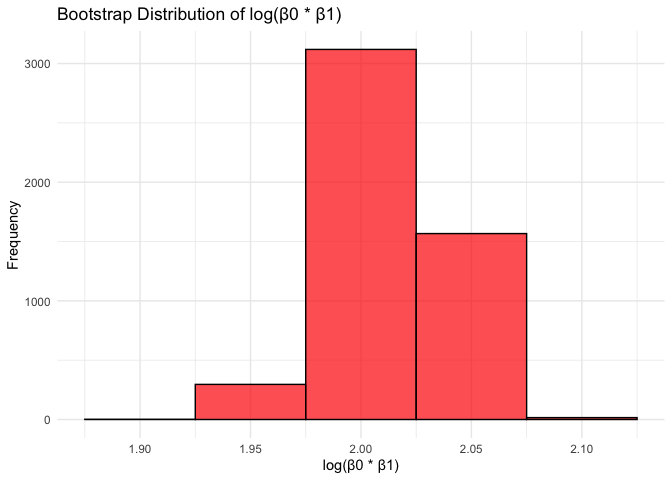
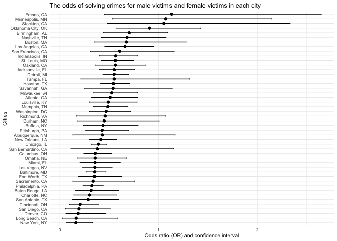
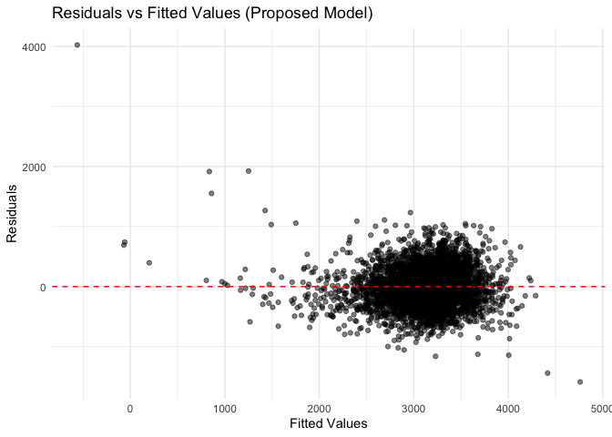
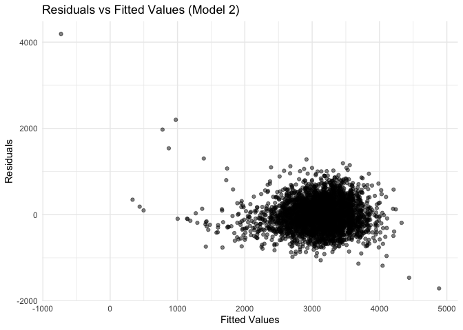
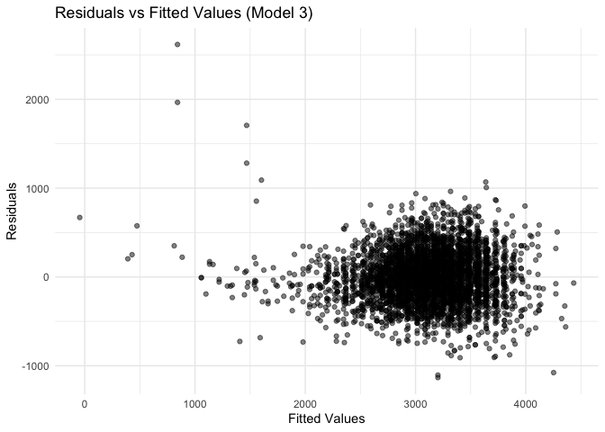
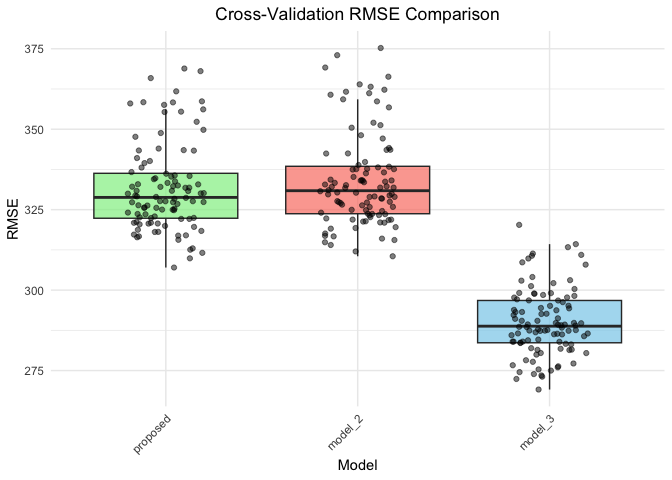

p8105_hw6_mx2286
================
William Xie
2024-12-01

\#Question 1

``` r
# Pull weather data
weather_df = 
  rnoaa::meteo_pull_monitors(
    c("USW00094728"),
    var = c("PRCP", "TMIN", "TMAX"), 
    date_min = "2017-01-01",
    date_max = "2017-12-31") %>%
  mutate(
    name = recode(id, USW00094728 = "CentralPark_NY"),
    tmin = tmin / 10,
    tmax = tmax / 10) %>%
  select(name, id, everything())
```

    ## using cached file: /Users/williamshie/Library/Caches/org.R-project.R/R/rnoaa/noaa_ghcnd/USW00094728.dly

    ## date created (size, mb): 2024-12-02 15:04:31.188985 (8.667)

    ## file min/max dates: 1869-01-01 / 2024-11-30

``` r
# Bootstrap function
bootstrap_function <- function(data, n_bootstrap = 5000) {
  # Initialize vectors to store results
  r_squared_values <- numeric(n_bootstrap)
  log_beta_product_values <- numeric(n_bootstrap)
  
  for (i in 1:n_bootstrap) {
    # Sample with replacement
    boot_sample <- data %>%
      slice_sample(n = nrow(data), replace = TRUE)
    
    # Perform linear regression
    model <- lm(tmax ~ tmin, data = boot_sample)
    
    # Extract R^2
    r_squared_values[i] <- glance(model)$r.squared
    
    # Extract regression coefficients
    beta_coefficients <- coef(model)
    beta_0 <- beta_coefficients[1]
    beta_1 <- beta_coefficients[2]
    
    # Compute log(β0 * β1), avoiding log(0) or negative issues
    if (!is.na(beta_0 * beta_1) && beta_0 * beta_1 != 0) {
      log_beta_product_values[i] <- log(abs(beta_0 * beta_1))
    } else {
      log_beta_product_values[i] <- NA
    }
  }
  
  return(list(r_squared = r_squared_values, log_beta_product = log_beta_product_values))
}

# Set seed for reproducibility
set.seed(123)

# Perform bootstrapping
bootstrap_results <- bootstrap_function(weather_df)

# Extract results
r_squared_values <- bootstrap_results$r_squared
log_beta_product_values <- bootstrap_results$log_beta_product

# Compute confidence intervals
r_squared_ci <- quantile(r_squared_values, probs = c(0.025, 0.975), na.rm = TRUE)
log_beta_product_ci <- quantile(log_beta_product_values, probs = c(0.025, 0.975), na.rm = TRUE)

# Print confidence intervals
print(paste("R-squared 95% CI:", paste(round(r_squared_ci, 3), collapse = " - ")))
```

    ## [1] "R-squared 95% CI: 0.895 - 0.927"

``` r
print(paste("log(β0 * β1) 95% CI:", paste(round(log_beta_product_ci, 3), collapse = " - ")))
```

    ## [1] "log(β0 * β1) 95% CI: 1.964 - 2.058"

``` r
# Plot distribution of R-squared values
ggplot(data.frame(r_squared = r_squared_values), aes(x = r_squared)) +
  geom_histogram(binwidth = 0.01, fill = "blue", color = "black", alpha = 0.7) +
  theme_minimal() +
  labs(title = "Bootstrap Distribution of R-squared", x = "R-squared", y = "Frequency")
```

<!-- -->

``` r
# Plot distribution of log(β0 * β1) values
ggplot(data.frame(log_beta_product = log_beta_product_values), aes(x = log_beta_product)) +
  geom_histogram(binwidth = 0.05, fill = "red", color = "black", alpha = 0.7) +
  theme_minimal() +
  labs(title = "Bootstrap Distribution of log(β0 * β1)", x = "log(β0 * β1)", y = "Frequency")
```

<!-- -->

``` r
homicide_data <- read.csv("homicide-data.csv")
head(homicide_data)
```

    ##          uid reported_date victim_last victim_first victim_race victim_age
    ## 1 Alb-000001      20100504      GARCIA         JUAN    Hispanic         78
    ## 2 Alb-000002      20100216     MONTOYA      CAMERON    Hispanic         17
    ## 3 Alb-000003      20100601 SATTERFIELD      VIVIANA       White         15
    ## 4 Alb-000004      20100101    MENDIOLA       CARLOS    Hispanic         32
    ## 5 Alb-000005      20100102        MULA       VIVIAN       White         72
    ## 6 Alb-000006      20100126        BOOK    GERALDINE       White         91
    ##   victim_sex        city state      lat       lon           disposition
    ## 1       Male Albuquerque    NM 35.09579 -106.5386 Closed without arrest
    ## 2       Male Albuquerque    NM 35.05681 -106.7153      Closed by arrest
    ## 3     Female Albuquerque    NM 35.08609 -106.6956 Closed without arrest
    ## 4       Male Albuquerque    NM 35.07849 -106.5561      Closed by arrest
    ## 5     Female Albuquerque    NM 35.13036 -106.5810 Closed without arrest
    ## 6     Female Albuquerque    NM 35.15111 -106.5378        Open/No arrest

\#Question 2

``` r
# Create a dummy variable 'resolved' based on the 'disposition' column
homicide_data <- homicide_data %>%
  mutate(resolved = ifelse(disposition %in% c("Closed without arrest", "Closed by arrest"), 1, 0))
head(homicide_data)
```

    ##          uid reported_date victim_last victim_first victim_race victim_age
    ## 1 Alb-000001      20100504      GARCIA         JUAN    Hispanic         78
    ## 2 Alb-000002      20100216     MONTOYA      CAMERON    Hispanic         17
    ## 3 Alb-000003      20100601 SATTERFIELD      VIVIANA       White         15
    ## 4 Alb-000004      20100101    MENDIOLA       CARLOS    Hispanic         32
    ## 5 Alb-000005      20100102        MULA       VIVIAN       White         72
    ## 6 Alb-000006      20100126        BOOK    GERALDINE       White         91
    ##   victim_sex        city state      lat       lon           disposition
    ## 1       Male Albuquerque    NM 35.09579 -106.5386 Closed without arrest
    ## 2       Male Albuquerque    NM 35.05681 -106.7153      Closed by arrest
    ## 3     Female Albuquerque    NM 35.08609 -106.6956 Closed without arrest
    ## 4       Male Albuquerque    NM 35.07849 -106.5561      Closed by arrest
    ## 5     Female Albuquerque    NM 35.13036 -106.5810 Closed without arrest
    ## 6     Female Albuquerque    NM 35.15111 -106.5378        Open/No arrest
    ##   resolved
    ## 1        1
    ## 2        1
    ## 3        1
    ## 4        1
    ## 5        1
    ## 6        0

``` r
homicide_data <- read.csv("homicide-data.csv") %>%
  mutate(
    resolved = ifelse(disposition %in% c("Closed without arrest", "Closed by arrest"), 1, 0),
    victim_age = as.numeric(victim_age),
    city_state = paste(city, state, sep = ", ")
  ) %>%
  filter(victim_race %in% c("White", "Black"), 
         !city %in% c("Dallas", "Tulsa"))
```

    ## Warning: There was 1 warning in `mutate()`.
    ## ℹ In argument: `victim_age = as.numeric(victim_age)`.
    ## Caused by warning:
    ## ! NAs introduced by coercion

``` r
baltimore_data <- homicide_data %>%
  filter(city_state == "Baltimore, MD")

model_baltimore <- glm(resolved ~ victim_age + victim_sex + victim_race, 
                       data = baltimore_data, 
                       family = binomial)

summary_baltimore <- broom::tidy(model_baltimore, exponentiate = TRUE, conf.int = TRUE)
print(summary_baltimore)
```

    ## # A tibble: 4 × 7
    ##   term             estimate std.error statistic  p.value conf.low conf.high
    ##   <chr>               <dbl>     <dbl>     <dbl>    <dbl>    <dbl>     <dbl>
    ## 1 (Intercept)         1.94    0.174        3.80 1.42e- 4    1.38      2.74 
    ## 2 victim_age          0.995   0.00325     -1.60 1.10e- 1    0.988     1.00 
    ## 3 victim_sexMale      0.355   0.143       -7.26 3.74e-13    0.267     0.468
    ## 4 victim_raceWhite    2.46    0.180        4.99 6.04e- 7    1.73      3.52

``` r
nested_data <- homicide_data %>%
  group_by(city_state) %>%
  nest() %>%
  mutate(data = map(data, ~filter(.x, !is.na(victim_age) & !is.na(victim_sex) & !is.na(victim_race))))

city_models <- nested_data %>%
  mutate(
    model = map(data, ~glm(resolved ~ victim_age + victim_sex + victim_race, data = .x, family = binomial)),
    results = map(model, ~broom::tidy(.x, exponentiate = TRUE, conf.int = TRUE))
  ) %>%
  unnest(results)
```

    ## Warning: There were 43 warnings in `mutate()`.
    ## The first warning was:
    ## ℹ In argument: `results = map(model, ~broom::tidy(.x, exponentiate = TRUE,
    ##   conf.int = TRUE))`.
    ## ℹ In group 1: `city_state = "Albuquerque, NM"`.
    ## Caused by warning:
    ## ! glm.fit: fitted probabilities numerically 0 or 1 occurred
    ## ℹ Run `dplyr::last_dplyr_warnings()` to see the 42 remaining warnings.

``` r
odds_ratios <- city_models %>%
  filter(term == "victim_sexMale") %>%
  select(city_state, estimate, conf.low, conf.high)

ggplot(odds_ratios, aes(x = reorder(city_state, estimate), y = estimate)) +
  geom_point() +
  geom_errorbar(aes(ymin = conf.low, ymax = conf.high), width = 0.2) +
  coord_flip() +
  labs(title = "The odds of solving crimes for male victims and female victims in each city",
       x = "Cities",
       y = "Odds ratio (OR) and confidence interval") +
  theme_minimal(base_size = 8)
```

<!-- -->

``` r
odds_ratios <- odds_ratios %>%
  arrange(desc(estimate))

head(odds_ratios)
```

    ## # A tibble: 6 × 4
    ## # Groups:   city_state [6]
    ##   city_state        estimate conf.low conf.high
    ##   <chr>                <dbl>    <dbl>     <dbl>
    ## 1 Fresno, CA           1.13     0.454      2.65
    ## 2 Minneapolis, MN      1.08     0.533      2.14
    ## 3 Stockton, CA         1.05     0.480      2.33
    ## 4 Oklahoma City, OK    0.909    0.578      1.42
    ## 5 Birmingham, AL       0.704    0.444      1.09
    ## 6 Nashville, TN        0.682    0.419      1.08

The OR of 1.129 in Fresno, CA, suggests that cases involving male
victims are more likely to be solved compared to those involving female
victims. However, the confidence interval of 0.454–2.648 includes 1,
indicating that this difference is not statistically significant.
Similarly, in Minneapolis, MN, and Stockton, CA, the ORs point to a
potential advantage for male victims, but the broad confidence intervals
weaken the certainty of these results.

\#Question 3

``` r
# Load and preprocess the dataset
birthweight_clean <- read_csv("birthweight.csv") %>%
  mutate(
    mrace = case_when(
      mrace == 1 ~ "White",
      mrace == 2 ~ "Black",
      mrace == 3 ~ "Asian",
      mrace == 4 ~ "Puerto Rican",
      mrace == 8 ~ "Other"
    ),
    frace = case_when(
      frace == 1 ~ "White",
      frace == 2 ~ "Black",
      frace == 3 ~ "Asian",
      frace == 4 ~ "Puerto Rican",
      frace == 8 ~ "Other",
      frace == 9 ~ "Unknown"
    ),
    babysex = case_when(
      babysex == 1 ~ "Male",
      babysex == 2 ~ "Female"
    ),
    blength = as.numeric(blength),
    bhead = as.numeric(bhead),
    gaweeks = as.numeric(gaweeks),
    ppwt = as.numeric(ppwt),
    wtgain = as.numeric(wtgain)
  ) %>%
  drop_na()
```

    ## Rows: 4342 Columns: 20
    ## ── Column specification ────────────────────────────────────────────────────────
    ## Delimiter: ","
    ## dbl (20): babysex, bhead, blength, bwt, delwt, fincome, frace, gaweeks, malf...
    ## 
    ## ℹ Use `spec()` to retrieve the full column specification for this data.
    ## ℹ Specify the column types or set `show_col_types = FALSE` to quiet this message.

``` r
# Check dataset summary
summary(birthweight_clean)
```

    ##    babysex              bhead          blength           bwt      
    ##  Length:4342        Min.   :21.00   Min.   :20.00   Min.   : 595  
    ##  Class :character   1st Qu.:33.00   1st Qu.:48.00   1st Qu.:2807  
    ##  Mode  :character   Median :34.00   Median :50.00   Median :3132  
    ##                     Mean   :33.65   Mean   :49.75   Mean   :3114  
    ##                     3rd Qu.:35.00   3rd Qu.:51.00   3rd Qu.:3459  
    ##                     Max.   :41.00   Max.   :63.00   Max.   :4791  
    ##      delwt          fincome         frace              gaweeks     
    ##  Min.   : 86.0   Min.   : 0.00   Length:4342        Min.   :17.70  
    ##  1st Qu.:131.0   1st Qu.:25.00   Class :character   1st Qu.:38.30  
    ##  Median :143.0   Median :35.00   Mode  :character   Median :39.90  
    ##  Mean   :145.6   Mean   :44.11                      Mean   :39.43  
    ##  3rd Qu.:157.0   3rd Qu.:65.00                      3rd Qu.:41.10  
    ##  Max.   :334.0   Max.   :96.00                      Max.   :51.30  
    ##     malform            menarche        mheight          momage    
    ##  Min.   :0.000000   Min.   : 0.00   Min.   :48.00   Min.   :12.0  
    ##  1st Qu.:0.000000   1st Qu.:12.00   1st Qu.:62.00   1st Qu.:18.0  
    ##  Median :0.000000   Median :12.00   Median :63.00   Median :20.0  
    ##  Mean   :0.003455   Mean   :12.51   Mean   :63.49   Mean   :20.3  
    ##  3rd Qu.:0.000000   3rd Qu.:13.00   3rd Qu.:65.00   3rd Qu.:22.0  
    ##  Max.   :1.000000   Max.   :19.00   Max.   :77.00   Max.   :44.0  
    ##     mrace               parity            pnumlbw     pnumsga      ppbmi      
    ##  Length:4342        Min.   :0.000000   Min.   :0   Min.   :0   Min.   :13.07  
    ##  Class :character   1st Qu.:0.000000   1st Qu.:0   1st Qu.:0   1st Qu.:19.53  
    ##  Mode  :character   Median :0.000000   Median :0   Median :0   Median :21.03  
    ##                     Mean   :0.002303   Mean   :0   Mean   :0   Mean   :21.57  
    ##                     3rd Qu.:0.000000   3rd Qu.:0   3rd Qu.:0   3rd Qu.:22.91  
    ##                     Max.   :6.000000   Max.   :0   Max.   :0   Max.   :46.10  
    ##       ppwt           smoken           wtgain      
    ##  Min.   : 70.0   Min.   : 0.000   Min.   :-46.00  
    ##  1st Qu.:110.0   1st Qu.: 0.000   1st Qu.: 15.00  
    ##  Median :120.0   Median : 0.000   Median : 22.00  
    ##  Mean   :123.5   Mean   : 4.145   Mean   : 22.08  
    ##  3rd Qu.:134.0   3rd Qu.: 5.000   3rd Qu.: 28.00  
    ##  Max.   :287.0   Max.   :60.000   Max.   : 89.00

\##Proposed Regression Model

The first model posits that birthweight is determined by *gestational
age* , *maternal pre-pregnancy weight* , and *birth length* , as well as
an interaction between gaweeks and blength.

``` r
# Fit the proposed model
proposed_model <- lm(bwt ~ babysex + gaweeks + ppwt + blength + blength:gaweeks, data = birthweight_clean)

# Summarize the proposed model
proposed_model_summary <- broom::tidy(proposed_model) %>%
  mutate(
    OR = exp(estimate),
    CI_upper = exp(estimate + 1.96 * std.error),
    CI_lower = exp(estimate - 1.96 * std.error)
  ) %>%
  select(term, estimate, OR, CI_lower, CI_upper, p.value)

# Display the summary as a table
proposed_model_summary %>%
  kable(digits = 3, caption = "Proposed Model Summary")
```

| term            |  estimate |           OR |     CI_lower |     CI_upper | p.value |
|:----------------|----------:|-------------:|-------------:|-------------:|--------:|
| (Intercept)     | -7902.015 | 0.000000e+00 | 0.000000e+00 | 0.000000e+00 |   0.000 |
| babysexMale     |    21.159 | 1.546573e+09 | 3.840000e+00 | 6.228757e+17 |   0.036 |
| gaweeks         |   117.796 | 1.439869e+51 | 2.849722e+34 | 7.275177e+67 |   0.000 |
| ppwt            |     1.915 | 6.784000e+00 | 4.143000e+00 | 1.110800e+01 |   0.000 |
| blength         |   196.594 | 2.396712e+85 | 2.025298e+72 | 2.836239e+98 |   0.000 |
| gaweeks:blength |    -1.861 | 1.560000e-01 | 7.100000e-02 | 3.420000e-01 |   0.000 |

Proposed Model Summary

``` r
# Add residuals and predictions
proposed_results <- birthweight_clean %>%
  mutate(
    pred = predict(proposed_model, newdata = birthweight_clean),
    resid = residuals(proposed_model)
  )

# Plot residuals vs fitted values
ggplot(proposed_results, aes(x = pred, y = resid)) +
  geom_point(alpha = 0.5) +
  geom_hline(yintercept = 0, color = "red", linetype = "dashed") +
  labs(
    title = "Residuals vs Fitted Values (Proposed Model)",
    x = "Fitted Values",
    y = "Residuals"
  ) +
  theme_minimal()
```

<!-- --> The
residual plot displayed acceptable dispersion with slight
heteroscedasticity at higher fitted values, suggesting room for
improvement while demonstrating adequate predictive performance across
most of the data range.

# Model 2: Birth Length and Gestational Age

``` r
model_2 <- lm(bwt ~ blength + gaweeks, data = birthweight_clean)

ggplot(birthweight_clean %>% 
         mutate(resid = residuals(model_2), pred = predict(model_2)), aes(x = pred, y = resid)) +
  geom_point(alpha = 0.5) +
  labs(
    title = "Residuals vs Fitted Values (Model 2)",
    x = "Fitted Values",
    y = "Residuals"
  ) +
  theme_minimal()
```

<!-- --> The
residuals showed greater dispersion around the fitted values compared to
the proposed model, suggesting less accurate predictions.

# Model 3: Head Circumference, Length, and Baby’s Sex with Interactions

``` r
model_3 <- lm(bwt ~ bhead * blength * babysex, data = birthweight_clean)

ggplot(birthweight_clean %>% 
         mutate(resid = residuals(model_3), pred = predict(model_3)), aes(x = pred, y = resid)) +
  geom_point(alpha = 0.5) +
  labs(
    title = "Residuals vs Fitted Values (Model 3)",
    x = "Fitted Values",
    y = "Residuals"
  ) +
  theme_minimal()
```

<!-- --> The
residuals formed a tighter cluster, indicating a better model fit
compared to Model 2, although it did not definitively surpass the
performance of the proposed model.

# Cross-Validation

``` r
cv_results <- crossv_mc(birthweight_clean, n = 100, test = 0.2) |> 
  mutate(
    train = map(train, as_tibble),
    test = map(test, as_tibble),
    proposed_model = map(train, ~ lm(bwt ~ babysex + gaweeks + ppwt + blength + blength:gaweeks, data = .x)),
    model_2 = map(train, ~ lm(bwt ~ blength + gaweeks, data = .x)),
    model_3 = map(train, ~ lm(bwt ~ bhead * blength * babysex, data = .x)),
    rmse_proposed = map2_dbl(proposed_model, test, ~ {
      preds <- predict(.x, newdata = .y)
      sqrt(mean((.y$bwt - preds)^2))
    }),
    rmse_model_2 = map2_dbl(model_2, test, ~ {
      preds <- predict(.x, newdata = .y)
      sqrt(mean((.y$bwt - preds)^2))
    }),
    rmse_model_3 = map2_dbl(model_3, test, ~ {
      preds <- predict(.x, newdata = .y)
      sqrt(mean((.y$bwt - preds)^2))
    })
  )

# Prepare cv_summary for plotting
cv_summary <- cv_results |> 
  select(starts_with("rmse")) |> 
  pivot_longer(
    cols = everything(),
    names_to = "model",
    values_to = "rmse",
    names_prefix = "rmse_"
  ) |>
  mutate(model = factor(model, levels = c("proposed", "model_2", "model_3")))

# Plot RMSE comparison
ggplot(cv_summary, aes(x = model, y = rmse, fill = model)) +
  geom_boxplot(alpha = 0.7, outlier.shape = NA) + 
  geom_jitter(width = 0.2, alpha = 0.5, color = "black") + 
  scale_fill_manual(values = c("lightgreen", "salmon", "skyblue")) + 
  labs(
    title = "Cross-Validation RMSE Comparison",
    x = "Model",
    y = "RMSE",
    fill = "Model"
  ) +
  theme_minimal() +
  theme(
    legend.position = "none",
    plot.title = element_text(hjust = 0.5),
    axis.text.x = element_text(angle = 45, hjust = 1)
  )
```

<!-- -->

The RMSE comparison revealed that Model 3 had the lowest median RMSE
(~310) and the least variation, indicating its superior predictive
performance, likely due to the inclusion of interaction terms. The
proposed model demonstrated a median RMSE of ~330, consistently
outperforming Model 2 (median RMSE ~350), but it fell slightly short of
Model 3 in accuracy. These findings, visualized in a boxplot, highlight
the proposed model’s reliability while underscoring the enhanced
predictive power of interaction effects in Model 3.
