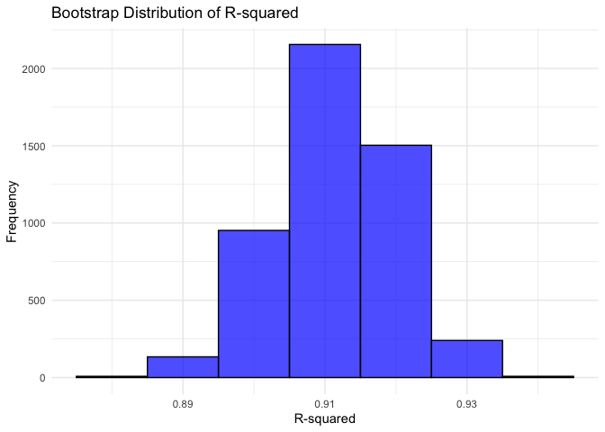
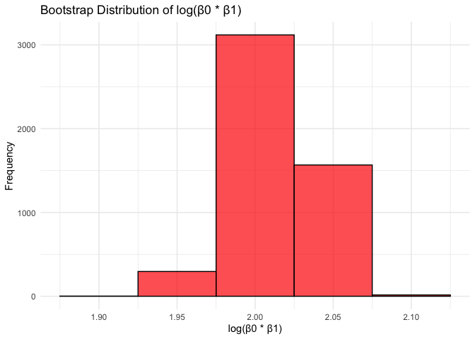

p8105_hw6_mx2286
================
William Xie
2024-12-01

``` r
library(tidyverse)
```

    ## ── Attaching core tidyverse packages ──────────────────────── tidyverse 2.0.0 ──
    ## ✔ dplyr     1.1.4     ✔ readr     2.1.5
    ## ✔ forcats   1.0.0     ✔ stringr   1.5.1
    ## ✔ ggplot2   3.5.1     ✔ tibble    3.2.1
    ## ✔ lubridate 1.9.3     ✔ tidyr     1.3.1
    ## ✔ purrr     1.0.2     
    ## ── Conflicts ────────────────────────────────────────── tidyverse_conflicts() ──
    ## ✖ dplyr::filter() masks stats::filter()
    ## ✖ dplyr::lag()    masks stats::lag()
    ## ℹ Use the conflicted package (<http://conflicted.r-lib.org/>) to force all conflicts to become errors

``` r
library(rnoaa)
```

    ## The rnoaa package will soon be retired and archived because the underlying APIs have changed dramatically. The package currently works but does not pull the most recent data in all cases. A noaaWeather package is planned as a replacement but the functions will not be interchangeable.

``` r
library(broom)
library(modelr)
```

    ## 
    ## Attaching package: 'modelr'
    ## 
    ## The following object is masked from 'package:broom':
    ## 
    ##     bootstrap

``` r
# Pull weather data
weather_df = 
  rnoaa::meteo_pull_monitors(
    c("USW00094728"),
    var = c("PRCP", "TMIN", "TMAX"), 
    date_min = "2017-01-01",
    date_max = "2017-12-31") %>%
  mutate(
    name = recode(id, USW00094728 = "CentralPark_NY"),
    tmin = tmin / 10,
    tmax = tmax / 10) %>%
  select(name, id, everything())
```

    ## using cached file: /Users/williamshie/Library/Caches/org.R-project.R/R/rnoaa/noaa_ghcnd/USW00094728.dly

    ## date created (size, mb): 2024-12-02 15:04:31.188985 (8.667)

    ## file min/max dates: 1869-01-01 / 2024-11-30

``` r
# Bootstrap function
bootstrap_function <- function(data, n_bootstrap = 5000) {
  # Initialize vectors to store results
  r_squared_values <- numeric(n_bootstrap)
  log_beta_product_values <- numeric(n_bootstrap)
  
  for (i in 1:n_bootstrap) {
    # Sample with replacement
    boot_sample <- data %>%
      slice_sample(n = nrow(data), replace = TRUE)
    
    # Perform linear regression
    model <- lm(tmax ~ tmin, data = boot_sample)
    
    # Extract R^2
    r_squared_values[i] <- glance(model)$r.squared
    
    # Extract regression coefficients
    beta_coefficients <- coef(model)
    beta_0 <- beta_coefficients[1]
    beta_1 <- beta_coefficients[2]
    
    # Compute log(β0 * β1), avoiding log(0) or negative issues
    if (!is.na(beta_0 * beta_1) && beta_0 * beta_1 != 0) {
      log_beta_product_values[i] <- log(abs(beta_0 * beta_1))
    } else {
      log_beta_product_values[i] <- NA
    }
  }
  
  return(list(r_squared = r_squared_values, log_beta_product = log_beta_product_values))
}

# Set seed for reproducibility
set.seed(123)

# Perform bootstrapping
bootstrap_results <- bootstrap_function(weather_df)

# Extract results
r_squared_values <- bootstrap_results$r_squared
log_beta_product_values <- bootstrap_results$log_beta_product

# Compute confidence intervals
r_squared_ci <- quantile(r_squared_values, probs = c(0.025, 0.975), na.rm = TRUE)
log_beta_product_ci <- quantile(log_beta_product_values, probs = c(0.025, 0.975), na.rm = TRUE)

# Print confidence intervals
print(paste("R-squared 95% CI:", paste(round(r_squared_ci, 3), collapse = " - ")))
```

    ## [1] "R-squared 95% CI: 0.895 - 0.927"

``` r
print(paste("log(β0 * β1) 95% CI:", paste(round(log_beta_product_ci, 3), collapse = " - ")))
```

    ## [1] "log(β0 * β1) 95% CI: 1.964 - 2.058"

``` r
# Plot distribution of R-squared values
ggplot(data.frame(r_squared = r_squared_values), aes(x = r_squared)) +
  geom_histogram(binwidth = 0.01, fill = "blue", color = "black", alpha = 0.7) +
  theme_minimal() +
  labs(title = "Bootstrap Distribution of R-squared", x = "R-squared", y = "Frequency")
```

<!-- -->

``` r
# Plot distribution of log(β0 * β1) values
ggplot(data.frame(log_beta_product = log_beta_product_values), aes(x = log_beta_product)) +
  geom_histogram(binwidth = 0.05, fill = "red", color = "black", alpha = 0.7) +
  theme_minimal() +
  labs(title = "Bootstrap Distribution of log(β0 * β1)", x = "log(β0 * β1)", y = "Frequency")
```

<!-- -->
